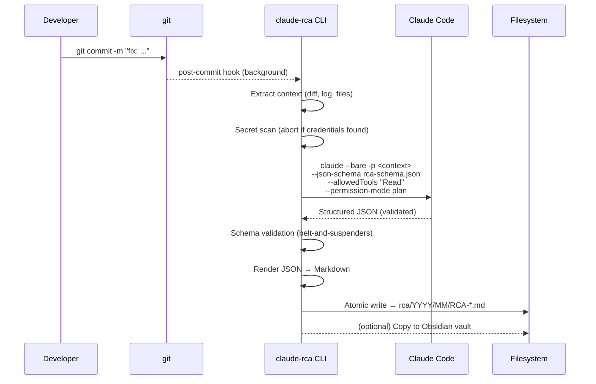
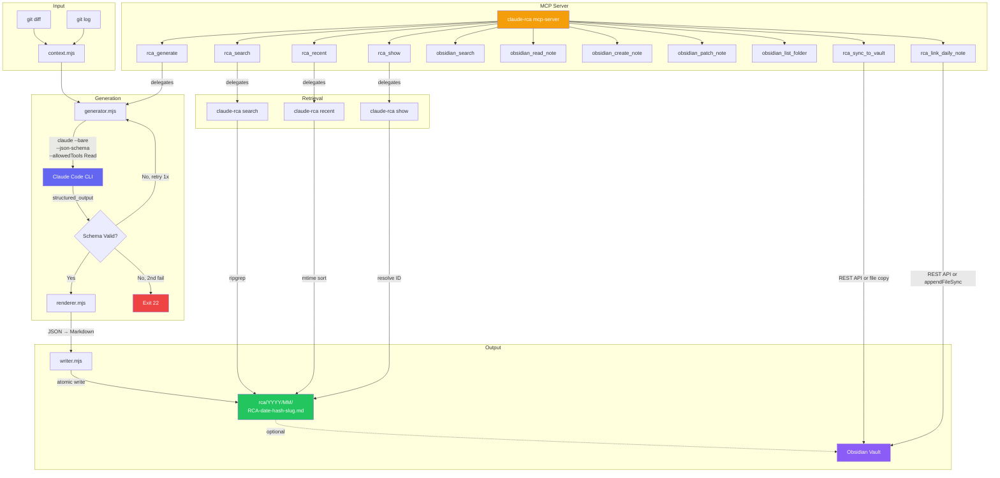
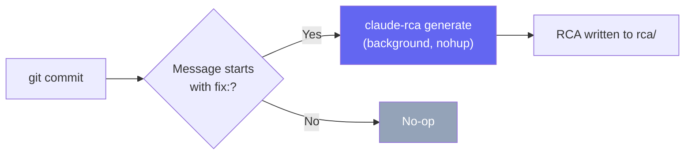
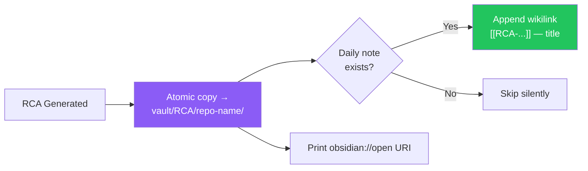
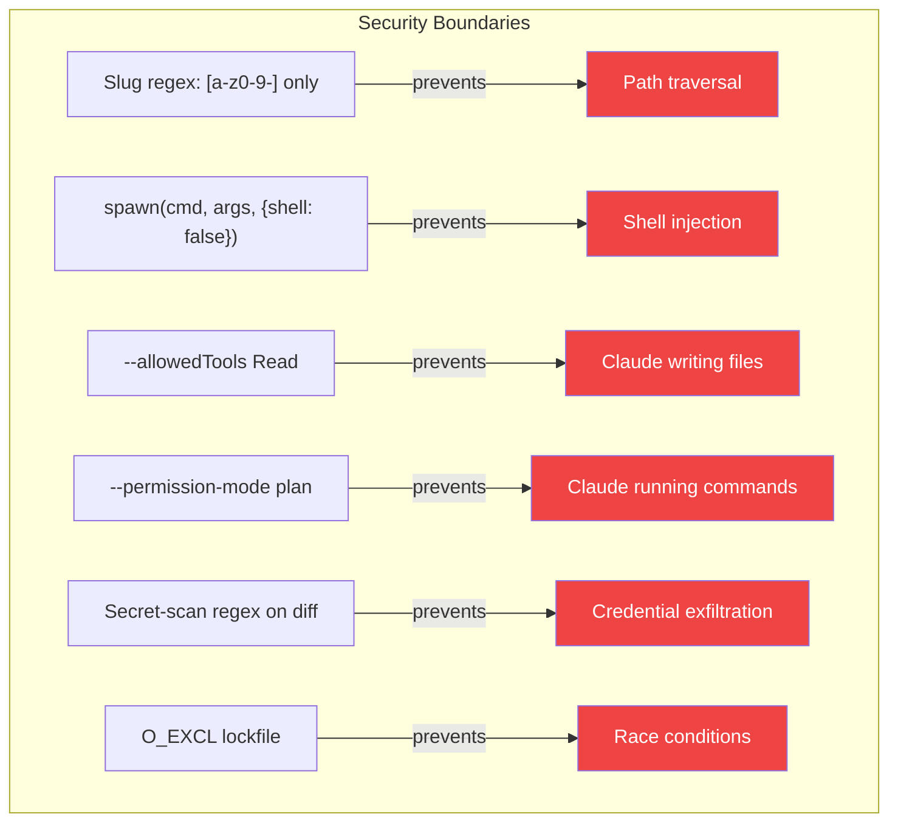
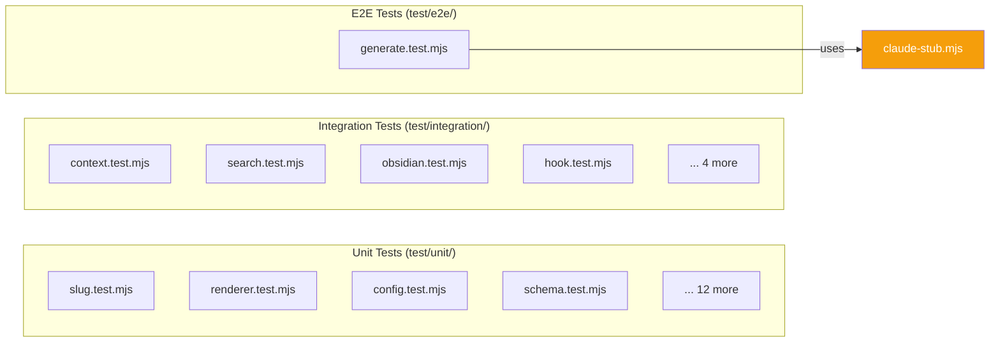

<p align="center">
  = 20" />
  
  
  
  
  
</p>

<h1 align="center">RCA-Ninja</h1>

<p align="center">
  <strong>Turn bug-fix commits into structured Root Cause Analysis documents in under 30 seconds.</strong>
</p>

<p align="center">
  A local-first, <strong>LLM-agnostic</strong> CLI that drives your coding agent CLI — <a href="https://docs.anthropic.com/en/docs/claude-code">Claude Code</a> (<code>claude -p</code>) or <a href="https://github.com/openai/codex">OpenAI Codex</a> (<code>codex exec</code>) — to produce validated, searchable RCA Markdown artifacts from <code>git diff</code> output, with optional Obsidian vault sync.
</p>

---

## Why RCA-Ninja?

```
Before:  git commit -m "fix: null-check session"  →  reasoning evaporates
After:   git commit + claude-rca generate          →  structured RCA on disk in <30s
```

Three months later, a similar bug surfaces:

```bash
claude-rca search "null pointer"
# → rca/2026/04/RCA-2026-04-25-a3f2c1d-session-middleware-null-pointer.md
```

Your entire bug-fix history becomes a searchable knowledge base — no postmortem meetings, no wiki pages that rot.

---

## Features

|                 | Feature                   | Description                                                                                   |
| --------------- | ------------------------- | --------------------------------------------------------------------------------------------- |
| **Automated**   | One-command generation    | `claude-rca generate` analyzes the diff and produces a structured RCA                         |
| **Validated**   | Schema-enforced output    | JSON Schema validation at generation time — no malformed documents                            |
| **Searchable**  | ripgrep-powered search    | Full-text search across your entire RCA corpus in milliseconds                                |
| **Secure**      | Read-only Claude access   | Claude cannot write, edit, or shell out during generation                                     |
| **Atomic**      | Crash-safe writes         | Every file write uses tmp → fsync → rename — no partial files                                 |
| **Hookable**    | Git hook automation       | Auto-generate RCAs on every `fix:` commit in the background                                   |
| **Obsidian**    | Vault sync                | Atomically copies RCAs to your Obsidian vault with daily note links                           |
| **Portable**    | Plain Markdown output     | Works with GitHub, Obsidian, `grep`, `cat` — anything that reads `.md`                        |
| **Quality**     | Auto-fill tracking        | Fields patched by the generator are flagged via `auto_filled` in frontmatter                  |
| **Audit**       | Corpus quality check      | `claude-rca audit` flags degraded RCAs with auto-filled fields                                |
| **Blame**       | Bug introduction tracking | `bug_introduced_by` in frontmatter shows when/who introduced the bug                          |
| **Webhooks**    | Slack/Discord/generic     | POST a notification on RCA generation to any webhook URL                                      |
| **Progress**    | Spinner UX                | TTY-aware spinner with phase markers and elapsed time                                         |
| **Templates**   | Per-project customization | Override schema and prompt via `.claude-rca/` directory                                       |
| **Wizard**      | Interactive setup         | `claude-rca setup` configures vault, API keys, and hooks in one command                       |
| **Dedup**       | Related RCA detection     | Finds duplicate/related RCAs before generating, links them in references                      |
| **Code Diffs**  | Before/After code blocks  | Embeds actual code changes with syntax highlighting in every RCA                              |
| **AI-Native**   | Cross-tool discovery      | AGENTS.md + manifest + rules make RCAs findable by Codex, Cursor, Copilot                     |
| **Per-Project** | Vault folder routing      | Auto-routes RCAs to project-specific Obsidian folders (`RCA/<repo-name>/`)                    |
| **Context**     | Cross-RCA injection       | Injects prior root causes for same files so Claude spots recurrence patterns                  |
| **Backfill**    | Batch historical RCAs     | `generate --since <ref>` creates RCAs for all past `fix:` commits in one run                  |
| **Recurrence**  | `prior_bugs` frontmatter  | Flags repeated failures: manifest entries sharing files appear in frontmatter                 |
| **Trends**      | Corpus aggregation        | `claude-rca trends` shows hot files, top tags, and repeat offender areas                      |
| **Amend**       | Correction re-generation  | `claude-rca amend <id> --hint "..."` re-runs Claude with a fix note in place                  |
| **Analyst**     | Quality auto-check        | `generate --analyze` runs `rca-analyst` after write; prompts to amend on TTY if REVISE/REJECT |

---

## One-Line Install

### macOS / Linux

```bash
curl -fsSL https://raw.githubusercontent.com/Muminur/RCA-Ninja/main/scripts/install.sh | bash
```

### Windows (PowerShell)

```powershell
irm https://raw.githubusercontent.com/Muminur/RCA-Ninja/main/scripts/install.ps1 | iex
```

The installer automatically:

1. Checks/installs prerequisites (Node.js, git, ripgrep, Claude Code CLI)
2. Clones the repo and runs `npm ci && npm link`
3. Runs `claude-rca doctor` to verify the environment
4. **(Interactive)** Offers to set up [Obsidian REST API](#obsidian-rest-api-integration) — enter your API key to enable vault sync
5. **(Interactive)** Offers to configure [MCP Server](#mcp-server-claude-integration) in Claude Desktop

> When piped (`curl | bash`), interactive prompts default to "no" — run the script directly for the full setup experience: `bash ~/.claude-rca/scripts/install.sh`

### npm (if prerequisites are already installed)

```bash
npm install -g claude-rca
```

### From source

```bash
git clone https://github.com/Muminur/RCA-Ninja.git
cd RCA-Ninja
npm ci && npm link
```

> **Prerequisites:** Node.js >= 20 · git >= 2.20 · [ripgrep](https://github.com/BurntSushi/ripgrep#installation) · **one LLM CLI**: either [Claude Code](https://docs.anthropic.com/en/docs/claude-code) (`npm i -g @anthropic-ai/claude-code && claude login`) or [OpenAI Codex](https://github.com/openai/codex) (`npm i -g @openai/codex && codex login`).
>
> RCA generation works with your Claude.ai or ChatGPT OAuth login — no separate API key needed. Choose the backend with `claude-rca config --set provider=claude|codex` (see [LLM Providers](#llm-providers-claude-code-or-codex)).

---

## Quick Start

```bash
# 1. Initialize in your repo (creates config + installs git hooks automatically)
cd your-git-repo
claude-rca init

# 2. Enable auto-generation + Obsidian sync
claude-rca config --set auto_generate=true
claude-rca config --set obsidian.enabled=true
claude-rca config --set "obsidian.vault_path=/path/to/vault"

# 3. (Optional) Add Obsidian REST API key for richer sync
cp .env.example .env    # then edit .env → add OBSIDIAN_API_KEY

# 4. That's it! Every fix: commit auto-generates an RCA in the background
git commit -m "fix: null-check session before dereferencing user.id"
# → RCA generated, synced to Obsidian vault, wikilink added to daily note

# 5. Or generate manually for any commit
claude-rca generate
claude-rca generate --from HEAD~3

# 5b. Backfill RCAs for all past fix: commits since a tag/ref
claude-rca generate --since v1.0.0

# 5c. Generate with quality analyst check (prompts to amend if quality is low)
claude-rca generate --analyze

# 6. Search your corpus
claude-rca search "null pointer"
claude-rca recent 5
claude-rca show RCA-2026-04-26-a3f2c1d-null-check-session

# 7. View corpus trends — hot files, top tags, recurrent bug areas
claude-rca trends
claude-rca trends --json

# 8. Correct a generated RCA with a re-run hint
claude-rca amend RCA-2026-04-26-a3f2c1d --hint "The root cause was actually a race condition, not a null check"

# 9. Verify your environment
claude-rca doctor
```

---

## How It Works



---

## Architecture



### Module Map

```
claude-rca/
├── bin/claude-rca          # Thin shebang entry point
├── src/
│   ├── cli.mjs             # Commander-based CLI routing
│   ├── config.mjs          # Config discovery, merge, validation
│   ├── context.mjs         # Git diff + log → Context object
│   ├── errors.mjs          # Typed RcaError with exit codes
│   ├── generator.mjs       # Orchestrates Claude invocation
│   ├── obsidian.mjs        # Vault sync + daily note append
│   ├── renderer.mjs        # JSON → Markdown with frontmatter
│   ├── schema.mjs          # AJV schema compilation
│   ├── search.mjs          # Manifest + ripgrep hybrid search; --files post-filters by manifest
│   ├── slug.mjs            # Deterministic URL-safe slug generation
│   ├── writer.mjs          # Atomic file writer with collision handling
│   ├── audit.mjs           # RCA corpus quality auditing
│   ├── dedup.mjs           # Duplicate/related RCA detection
│   ├── progress.mjs        # TTY-aware spinner with phases
│   ├── template.mjs        # Per-project schema/prompt overrides
│   ├── webhook.mjs         # Slack/Discord/generic webhook notifications
│   ├── obsidian-api.mjs    # REST API client for Obsidian Local REST API
│   ├── manifest.mjs        # Auto-generated JSONL manifest for AI discovery
│   ├── mcp-server.mjs      # MCP protocol server (7 core + 7 conditional tools)
│   ├── analyst.mjs         # rca-analyst quality verdict runner
│   └── util/
│       ├── exec.mjs        # Safe spawn wrapper (no shell)
│       ├── fs.mjs          # atomicWrite, acquireLock, releaseLock
│       └── git.mjs         # Typed git command wrappers
├── prompts/
│   ├── rca-schema.json     # JSON Schema for RCA output
│   └── rca-system.md       # System prompt for Claude
├── hooks/
│   ├── post-commit         # Auto-generate on fix: commits
│   ├── commit-msg          # Conventional Commits enforcement
│   └── install-hook.sh     # Idempotent hook installer
├── scripts/
│   ├── install.sh          # macOS/Linux one-line installer
│   └── install.ps1         # Windows PowerShell installer
├── .env.example            # Template for Obsidian API credentials
├── AGENTS.md               # Cross-tool AI discovery (Codex, Cursor, Copilot)
├── .claudeignore           # Excludes rca/ from incidental Claude Code scans
└── test/                   # 472 tests (unit + integration + e2e)
```

---

## Sample RCA Output

When you run `claude-rca generate`, you get a Markdown file like this:

````markdown
---
title: 'Session middleware null-pointers when cookie domain mismatch occurs'
date: 2026-04-25T12:00:00Z
branch: main
confidence: high
files:
  - src/middleware/auth.js
  - src/lib/session.js
generated_by: claude-rca/0.1.0
ref: a3f2c1d
schema: claude-rca.rca.v1
tags: [rca, bugfix, auth, backend]
---

## Symptom

Requests intermittently returned 500 with TypeError Cannot read properties
of undefined reading id when users hit /api/me shortly after the cookie
domain was changed in config.

## Root Cause

The session loader returned undefined when the cookie domain mismatched the
request host, and the auth middleware proceeded to dereference
req.session.user.id without a null check.

## Fix

auth.js now treats req.session === undefined as unauthenticated and
short-circuits to 401. session.js was also updated to log a warning when
the cookie domain check fails so the upstream cause is observable.

## Code Changes

### `src/middleware/auth.js`

Added null check before dereferencing session user

**Before:**

```javascript
const userId = req.session.user.id;
```
````

**After:**

```javascript
if (!req.session) return res.status(401).json({ error: 'unauthenticated' });
const userId = req.session.user.id;
```

## Impact

All endpoints behind requireAuth. User-visible: brief 500s on /api/me,
/api/orders, /api/notifications. No data loss.

```

### RCA Schema Fields

| Field        | Type                   | Required | Description                             |
| ------------ | ---------------------- | -------- | --------------------------------------- |
| `title`      | string (8–80 chars)    | Yes      | Declarative sentence describing the bug |
| `symptom`    | string (20–800 chars)  | Yes      | Observable symptoms                     |
| `root_cause` | string (20–1500 chars) | Yes      | Why the bug occurred                    |
| `fix`        | string (20–1500 chars) | Yes      | What was changed and why                |
| `impact`     | string (10–800 chars)  | Yes      | Blast radius — affected systems/users   |
| `files`      | string[] (1–50)        | Yes      | Files involved in the bug/fix           |
| `tags`       | string[] (2–6)         | Yes      | Lowercase labels, `[a-z0-9-]` pattern   |
| `confidence` | enum                   | Yes      | `high`, `medium`, `low`, or `unknown`   |
| `references` | string[]               | No       | Tickets, PRs, docs, links               |
| `code_changes` | object[]             | No       | Before/after code snippets (max 5)      |
| `description` | string (≤200 chars)   | No       | One-line summary for AI scanning        |
| `components` | string[]               | No       | Affected modules (`executor`, `web-ui`) |

---

## CLI Reference

### Commands

| Command                        | Description                                           |
| ------------------------------ | ----------------------------------------------------- |
| `claude-rca init`              | Create `.claude-rca.json` config and `rca/` directory |
| `claude-rca generate`          | Generate an RCA for a commit                          |
| `claude-rca search [query]`    | Hybrid search — manifest for metadata, ripgrep for text |
| `claude-rca recent [count]`    | List the N most recent RCAs (default: 10)             |
| `claude-rca show <id>`         | Display an RCA by filename, hash, or path             |
| `claude-rca config`            | Read/write configuration values                       |
| `claude-rca doctor`            | Verify environment (Node, git, rg, claude)            |
| `claude-rca obsidian sync`     | Sync an RCA file to the Obsidian vault                |
| `claude-rca mcp-server`        | Start the MCP server for Claude Desktop/Code          |
| `claude-rca setup`             | Interactive setup wizard                              |
| `claude-rca audit`             | Check RCA quality — flag auto-filled fields           |
| `claude-rca rebuild`           | Re-validate RCAs against current schema               |
| `claude-rca amend <id>`        | Re-generate an existing RCA in place with a fix hint  |
| `claude-rca trends`            | Show hot files, top tags, and repeat bug areas        |
| `claude-rca obsidian sync-all` | Sync all RCAs to Obsidian vault                       |

### Generate Options

```

claude-rca generate [options]

--from <ref> Git ref to analyze (default: HEAD)
--since <ref> Generate RCAs for all fix: commits since a git ref/tag
--message <msg> Override the commit message
--logs <file> Attach a log file to the analysis context
--dry-run Print the would-be output path without writing
--no-obsidian Skip Obsidian sync even if configured
--no-secret-scan Skip scanning the diff for secrets
--analyze Run rca-analyst quality check after generation

```

### Search Options

```

claude-rca search [query] [options]

--since <date> Filter results by date (manifest-backed when no query)
--tag <tag> Filter by tag (manifest-backed when no query)
--files <path> Find RCAs affecting a source file (manifest-backed)
--limit <n> Maximum results to return (default: 20)
--json Output results as JSON

```

### Amend Options

```

claude-rca amend <id> [options]

--hint <text> Correction note passed to Claude for the re-generation
--cwd <path> Working directory (default: current directory)

```

### Trends Options

```

claude-rca trends [options]

--json Output results as JSON

```

### Config Operations

```

claude-rca config --list # Print all config as JSON
claude-rca config --get <key> # Read a value
claude-rca config --set <key>=<value> # Write a value

````

---

## Configuration

`claude-rca init` creates `.claude-rca.json`:

```json
{
  "version": 1,
  "output_dir": "./rca",
  "provider": "claude",
  "claude": {
    "binary": "claude",
    "use_bare": true,
    "permission_mode": "plan",
    "allowed_tools": "Read",
    "timeout_ms": 60000,
    "max_retries": 1
  },
  "codex": {
    "binary": "codex",
    "sandbox": "read-only",
    "timeout_ms": 120000,
    "max_retries": 1
  },
  "obsidian": {
    "enabled": false,
    "vault_path": "",
    "target_folder": "RCA Inbox",
    "update_daily_note": true,
    "api_host": "127.0.0.1",
    "api_port": 27124
  },
  "log_level": "info"
}
````

> **Secrets go in `.env`, not config.** The Obsidian API key is loaded from environment variables — never store it in `.claude-rca.json`. See [Obsidian REST API Integration](#obsidian-rest-api-integration) for setup.

### Configuration Hierarchy


CLI flags override everything. Project config overrides XDG/defaults. Deep-merge for objects, replace for arrays.

---

## LLM Providers (Claude Code or Codex)

RCA-Ninja is **LLM-agnostic**. Generation, amend, and the quality analyst all run through a small provider abstraction (`src/providers/`), so the same workflow works whether you drive [Claude Code](https://docs.anthropic.com/en/docs/claude-code) or the [OpenAI Codex CLI](https://github.com/openai/codex). Pick one with `provider`:

```bash
# Use Claude Code (default)
claude-rca config --set provider=claude

# Use OpenAI Codex
claude-rca config --set provider=codex
```

| Concern              | `claude` (default)                                              | `codex`                                                            |
| -------------------- | -------------------------------------------------------------- | ----------------------------------------------------------------- |
| Invocation           | `claude -p … --json-schema … --allowedTools Read`              | `codex exec --sandbox read-only --output-schema … -o …`           |
| Read-only guarantee  | `--permission-mode plan` + `--allowedTools Read`               | `--sandbox read-only`                                             |
| Structured output    | `--json-schema` (native)                                       | `--output-schema` (OpenAI strict mode; derived automatically)     |
| Context delivery     | temp files read via the model's Read tool                      | inlined and piped via **stdin** (no OS arg-length limit)          |
| Auth                 | `claude login`                                                 | `codex login` (or `OPENAI_API_KEY`)                               |

Both adapters are validated locally with the same AJV schema after the model responds, so output guarantees are identical regardless of provider. `claude-rca doctor` checks whichever provider's binary you configured.

### Codex configuration keys

| Key                  | Default      | Description                                                       |
| -------------------- | ------------ | ---------------------------------------------------------------- |
| `codex.binary`       | `codex`      | Codex executable (or `node /path/to/stub.mjs` for testing)       |
| `codex.sandbox`      | `read-only`  | `read-only` · `workspace-write` · `danger-full-access`           |
| `codex.model`        | —            | Optional model override passed as `--model`                      |
| `codex.timeout_ms`   | `120000`     | Per-invocation timeout                                            |
| `codex.max_retries`  | `1`          | Retries on schema-validation failure                             |

> **Note:** Codex requires an authenticated session (`codex login`) and available usage quota, exactly as Claude Code requires `claude login`. If neither provider is reachable, `claude-rca doctor` reports it.

---

## Git Hooks (Optional)

```bash
bash hooks/install-hook.sh
```

Installs two hooks into `.git/hooks/`:

### post-commit



- Runs **in the background** — zero delay on your commit
- Only triggers on `fix:` prefixed commits (Conventional Commits)
- **Structured logging** to `~/.claude-rca/hook.log` on every invocation — never fails silently
- Failures write a `.last-rca-error` sentinel that `claude-rca doctor` reads

### commit-msg

Enforces [Conventional Commits](https://www.conventionalcommits.org/) format. Accepted prefixes:

`feat` · `fix` · `docs` · `style` · `refactor` · `perf` · `test` · `build` · `ci` · `chore` · `revert`

Merge commits, `Revert`, `fixup!`, and `squash!` are always passed through. The installer is idempotent and never overwrites hooks it did not create. On install, it also verifies bash is available and attempts `npm link` to make `claude-rca` globally accessible on PATH.

---

## Obsidian Integration (Optional)

```bash
claude-rca config --set obsidian.enabled=true
claude-rca config --set obsidian.vault_path=/path/to/vault
```



- Files are **atomically** copied (no partial writes in your vault)
- `.obsidian/` directory is **never touched** — existence check only
- Daily note append is **idempotent** (no duplicate entries)
- Obsidian failures are logged as warnings and **never block** generation
- **Per-project folders**: RCAs route to `RCA/<repo-name>/` automatically (configurable via `obsidian.target_folder`)

---

## AI-Native Discovery

RCA-Ninja is designed to be discoverable by any AI coding tool — not just Claude Code.

### How AI tools find your RCAs

| Tool               | Discovery mechanism                                                                                  |
| ------------------ | ---------------------------------------------------------------------------------------------------- |
| **Claude Code**    | `CLAUDE.md` + `.claude/rules/rca-discovery.md` (conditional, loads only when working with RCA files) |
| **Codex CLI**      | `AGENTS.md` (cross-tool standard, auto-read at session start)                                        |
| **Cursor**         | `AGENTS.md` + `.cursor/rules/`                                                                       |
| **GitHub Copilot** | `AGENTS.md`                                                                                          |
| **Gemini CLI**     | `AGENTS.md`                                                                                          |
| **Windsurf**       | `AGENTS.md`                                                                                          |

### Manifest file

Every `generate` command auto-rebuilds `rca/_manifest.jsonl` — a compact JSONL index (one JSON object per line) of all RCA frontmatter. AI tools read this single file instead of scanning every document.

The search command uses this manifest automatically for `--tag`, `--since`, and `--files` queries — no ripgrep needed for metadata lookups.

```bash
# Find RCAs affecting a specific source file (reads manifest, not files)
claude-rca search --files src/web_ui.py

# Filter by tag (manifest-backed, instant)
claude-rca search --tag auth

# Full-text search (uses ripgrep with token caps)
claude-rca search "null pointer" --limit 10
```

**Token cost comparison (100 RCA corpus):**

| Approach                       | Tokens consumed |
| ------------------------------ | --------------- |
| Read all files                 | ~200,000        |
| Read manifest + 3 full matches | ~12,000         |
| `--files` manifest lookup      | ~300-800        |
| ripgrep with caps + 3 matches  | ~2,400          |

---

## Claude Code Integration

### Slash Commands

In any Claude Code session inside this project:

| Command                  | What it does                                         |
| ------------------------ | ---------------------------------------------------- |
| `/rca`                   | Dispatcher — route to any subcommand                 |
| `/rca-generate [ref]`    | Generate an RCA for a commit                         |
| `/rca-search <query>`    | Full-text search your RCA corpus                     |
| `/rca-recent [n]`        | List the newest N RCAs                               |
| `/rca-show <id>`         | Display a specific RCA by ID or hash                 |
| `/rca-audit`             | Audit corpus for degraded (auto-filled) RCAs         |
| `/rca-amend <id> [hint]` | Re-generate an RCA in place with optional correction |
| `/rca-trends`            | Show tag/file/component frequency and bug hotspots   |
| `/rca-doctor`            | Environment health check with fix suggestions        |

---

## Exit Codes

Every error is typed (`RcaError`) with a deterministic exit code:

| Exit  | Code                    | Category | Meaning                                       |
| ----- | ----------------------- | -------- | --------------------------------------------- |
| `0`   | —                       | —        | Success                                       |
| `10`  | `ALREADY_INIT`          | input    | Project already initialized                   |
| `20`  | `NO_DIFF`               | input    | No diff to analyze for the given ref          |
| `21`  | `CLAUDE_FAILURE`        | external | Claude subprocess exited non-zero             |
| `22`  | `SCHEMA_VALIDATION`     | external | Claude's output failed JSON schema validation |
| `23`  | `WRITE_CONFLICT`        | fs       | RCA already exists at destination             |
| `24`  | `DISK_ERROR`            | fs       | Filesystem error during write                 |
| `25`  | `TOKEN_BUDGET_EXCEEDED` | input    | Diff payload exceeds token budget             |
| `30`  | `RIPGREP_MISSING`       | env      | `rg` not on PATH                              |
| `40`  | `NOT_FOUND`             | input    | RCA not found by ID or path                   |
| `50`  | `INVALID_CONFIG_*`      | input    | Invalid config key or value                   |
| `60`  | `NO_VAULT`              | env      | Obsidian enabled but no vault configured      |
| `61`  | `INVALID_VAULT`         | env      | Vault path missing `.obsidian/`               |
| `70`  | `DOCTOR_UNHEALTHY`      | env      | Environment check failed                      |
| `100` | `INTERNAL`              | bug      | Unexpected error — please file a bug          |

---

## Security



- **Zero shell interpolation**: All subprocess calls use `spawn(cmd, [args], { shell: false })`. CI greps for violations.
- **Read-only Claude**: During generation, Claude has `--allowedTools "Read"` and `--permission-mode plan`. It cannot write, edit, or execute commands.
- **Secret scanning**: Diffs are scanned for `api_key`, `secret`, `password`, `token` patterns before sending. Bypass with `--no-secret-scan`.
- **Path safety**: Slugs are restricted to `[a-z0-9-]`. Output paths are `path.resolve`d and asserted to start with `output_dir`.
- **No API key handling**: The wrapper never reads `ANTHROPIC_API_KEY`. Claude Code handles auth.
- **Atomic writes with locking**: `O_EXCL` lockfile prevents concurrent writes. Stale locks (>5 min) are auto-cleaned.

---

## Performance

| Operation                          | Budget   | Actual          |
| ---------------------------------- | -------- | --------------- |
| `init`                             | < 100 ms | ~50 ms          |
| Context extraction (≤ 200 KB diff) | < 300 ms | ~150 ms         |
| Generation end-to-end              | < 30 s   | 10–25 s typical |
| Markdown render                    | < 20 ms  | ~5 ms           |
| Atomic file write                  | < 100 ms | ~10 ms          |
| Search across 1k RCAs              | < 500 ms | ~200 ms         |
| Search across 10k RCAs             | < 2 s    | ~1.2 s          |
| Memory RSS                         | < 100 MB | ~40 MB          |

---

## MCP Server (Claude Integration)

RCA-Ninja includes a built-in MCP (Model Context Protocol) server that lets Claude Desktop and Claude Code interact directly with your RCA corpus and Obsidian vault.

### Start the MCP server

```bash
claude-rca mcp-server
```

### Configure Claude Desktop

Add to your `claude_desktop_config.json`:

- **macOS**: `~/Library/Application Support/Claude/claude_desktop_config.json`
- **Windows**: `%APPDATA%\Claude\claude_desktop_config.json`

```json
{
  "mcpServers": {
    "claude-rca": {
      "command": "claude-rca",
      "args": ["mcp-server"]
    }
  }
}
```

### Available MCP Tools

| Tool                   | Description                                                   |
| ---------------------- | ------------------------------------------------------------- |
| `rca_generate`         | Generate an RCA for a commit ref                              |
| `rca_search`           | Search RCA corpus — query optional when tag/since/files given |
| `rca_recent`           | List N most recent RCAs                                       |
| `rca_show`             | Read a specific RCA by ID/hash                                |
| `rca_audit`            | Audit corpus for degraded (auto-filled) documents             |
| `rca_trends`           | Tag/file/component frequency and hotspot analysis             |
| `rca_amend`            | Re-generate an RCA in place with optional correction hint     |
| `obsidian_search`      | Full-text search via Obsidian REST API                        |
| `obsidian_read_note`   | Read any note from the vault                                  |
| `obsidian_create_note` | Create a note in the vault                                    |
| `obsidian_patch_note`  | Insert content at a heading/block                             |
| `obsidian_list_folder` | List files in a vault folder                                  |
| `rca_sync_to_vault`    | Push an RCA to vault (REST API or filesystem)                 |
| `rca_link_daily_note`  | Append wikilink to today's daily note                         |

The RCA tools work without Obsidian. The `obsidian_*` tools require the [Local REST API plugin](https://github.com/coddingtonbear/obsidian-local-rest-api).

---

## Obsidian REST API Integration

For richer Obsidian integration beyond filesystem copy, RCA-Ninja connects to the [Local REST API plugin](https://github.com/coddingtonbear/obsidian-local-rest-api) — giving you vault search, remote access, and PATCH-based daily note updates.

### Setup (3 steps)

**Step 1:** Install the "Local REST API" community plugin in Obsidian (Settings → Community Plugins → Browse → search "Local REST API" → Install → Enable)

**Step 2:** Copy your API key from Settings → Local REST API

**Step 3:** Create a `.env` file in your project root (never committed — already in `.gitignore`):

```bash
# Copy the template
cp .env.example .env

# Edit with your API key
```

```env
# .env
OBSIDIAN_API_KEY=your-api-key-here
OBSIDIAN_HOST=127.0.0.1
OBSIDIAN_PORT=27124
```

That's it. RCA-Ninja automatically reads `.env` on startup — no `config --set` needed for secrets.

> **Security:** The `.env` file is gitignored. The API key is loaded via environment variable, never stored in `.claude-rca.json`. You can also export `OBSIDIAN_API_KEY` in your shell profile instead of using `.env`.

### Environment Variables

| Variable           | Default     | Description                    |
| ------------------ | ----------- | ------------------------------ |
| `OBSIDIAN_API_KEY` | —           | Bearer token for REST API auth |
| `OBSIDIAN_HOST`    | `127.0.0.1` | Obsidian REST API host         |
| `OBSIDIAN_PORT`    | `27124`     | Obsidian REST API port         |

### What changes with the REST API

| Feature               | Filesystem (default) | REST API              |
| --------------------- | -------------------- | --------------------- |
| Sync RCA to vault     | File copy            | HTTP PUT via REST API |
| Daily note append     | appendFileSync       | HTTP PATCH            |
| Search vault          | ripgrep on files     | Obsidian's full index |
| Remote vaults         | Not supported        | Supported             |
| Obsidian must be open | No                   | Yes                   |
| Credentials           | N/A                  | `.env` file           |

---

## Webhook Notifications

```bash
claude-rca config --set webhooks.enabled=true
claude-rca config --set webhooks.url=https://hooks.slack.com/services/...
claude-rca config --set webhooks.format=slack   # or: discord, generic
```

Supported formats: `slack` (Slack incoming webhook), `discord` (Discord webhook), `generic` (raw JSON POST).

---

## Custom Templates

Override the default RCA schema or system prompt per-project:

```bash
mkdir .claude-rca
cp node_modules/claude-rca/prompts/rca-schema.json .claude-rca/
cp node_modules/claude-rca/prompts/rca-system.md .claude-rca/
# Edit to customize fields, prompts, etc.
```

---

## Development

```bash
npm test                  # unit tests
npm run test:integration  # integration tests
npm run test:e2e          # e2e tests with claude-stub
npm run coverage          # c8 report (target ≥83%)
npm run check             # lint + typecheck + test + coverage gate (576 total)
npm run lint              # eslint + prettier
npm run format            # auto-format with prettier
```

### Test Architecture



The e2e tests use `test/fixtures/claude-stub.mjs` — a deterministic stub that emulates `claude --bare` and returns canned responses keyed by diff hash. No API calls needed to run the test suite.

**CI:** GitHub Actions on Node 20, Ubuntu and macOS, on every push and pull request.

---

## Uninstall

```bash
# Remove the CLI
npm unlink -g claude-rca

# Remove git hooks (if installed)
rm .git/hooks/post-commit .git/hooks/commit-msg

# Remove the install directory
rm -rf ~/.claude-rca

# Remove project config (in each repo where init was run)
rm .claude-rca.json
rm -rf rca/
```

---

## Roadmap

| Version        | Status   | Focus                                                |
| -------------- | -------- | ---------------------------------------------------- |
| **v0.1** (MVP) | Released | Generate, store, search, Obsidian sync, hooks        |
| v0.2           | Planned  | Diff-less mode (`generate --message ... --logs ...`) |
| v0.3           | Planned  | Bulk re-render (`claude-rca rebuild`)                |
| v0.4           | Planned  | Tag inference improvements via tagger subagent       |
| v1.0           | Planned  | Stable schema, semver guarantees, public release     |

---

## License

MIT — see [LICENSE](LICENSE).
