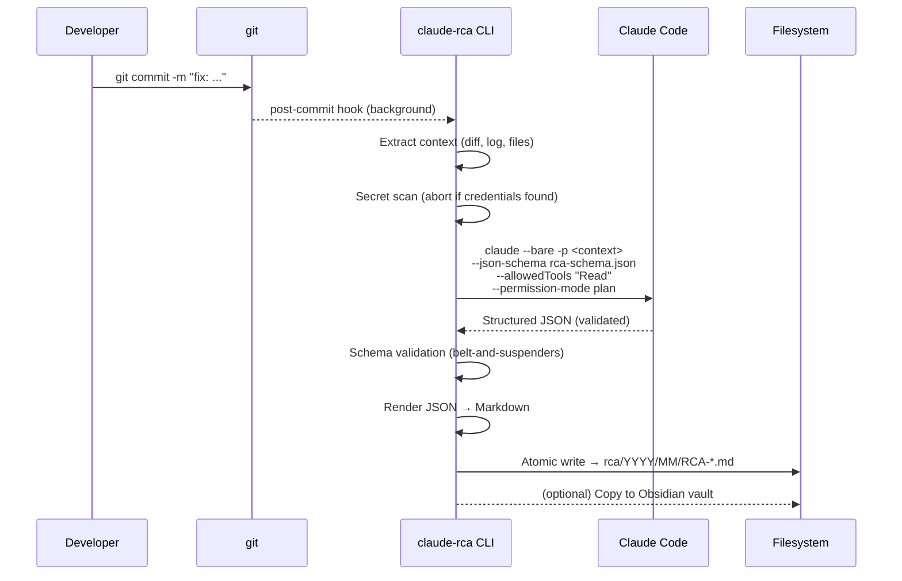
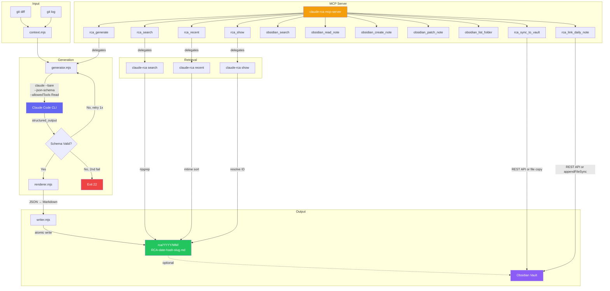
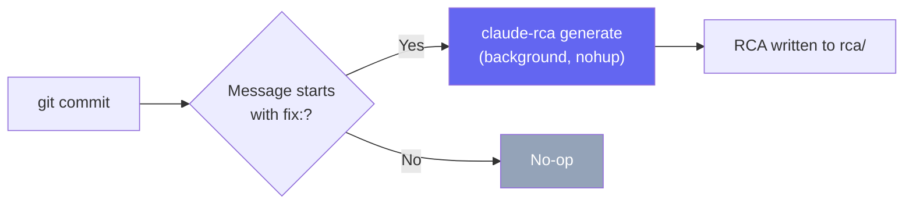
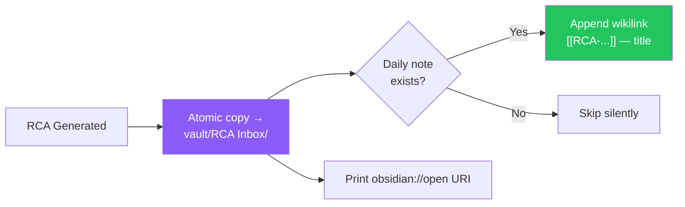
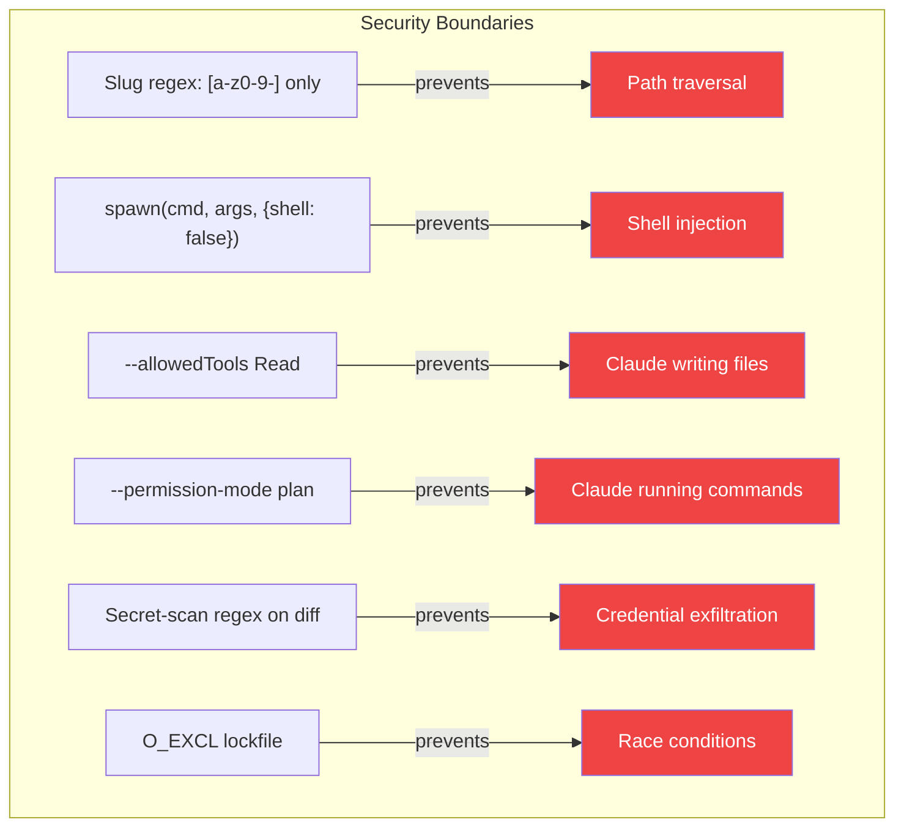
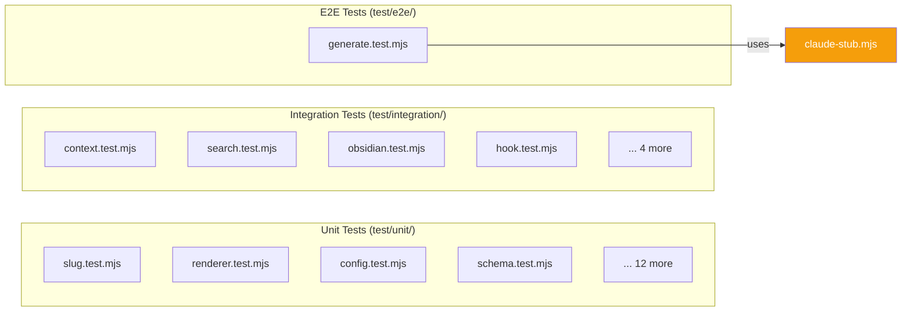

<p align="center">
  = 20" />
  
  
  
  
  
</p>

<h1 align="center">RCA-Ninja</h1>

<p align="center">
  <strong>Turn bug-fix commits into structured Root Cause Analysis documents in under 30 seconds.</strong>
</p>

<p align="center">
  A local-first CLI that wraps <code>claude --bare</code> to produce validated, searchable RCA Markdown artifacts from <code>git diff</code> output — with optional Obsidian vault sync.
</p>

---

## Why RCA-Ninja?

```
Before:  git commit -m "fix: null-check session"  →  reasoning evaporates
After:   git commit + claude-rca generate          →  structured RCA on disk in <30s
```

Three months later, a similar bug surfaces:

```bash
claude-rca search "null pointer"
# → rca/2026/04/RCA-2026-04-25-a3f2c1d-session-middleware-null-pointer.md
```

Your entire bug-fix history becomes a searchable knowledge base — no postmortem meetings, no wiki pages that rot.

---

## Features

|                | Feature                 | Description                                                            |
| -------------- | ----------------------- | ---------------------------------------------------------------------- |
| **Automated**  | One-command generation  | `claude-rca generate` analyzes the diff and produces a structured RCA  |
| **Validated**  | Schema-enforced output  | JSON Schema validation at generation time — no malformed documents     |
| **Searchable** | ripgrep-powered search  | Full-text search across your entire RCA corpus in milliseconds         |
| **Secure**     | Read-only Claude access | Claude cannot write, edit, or shell out during generation              |
| **Atomic**     | Crash-safe writes       | Every file write uses tmp → fsync → rename — no partial files          |
| **Hookable**   | Git hook automation     | Auto-generate RCAs on every `fix:` commit in the background            |
| **Obsidian**   | Vault sync              | Atomically copies RCAs to your Obsidian vault with daily note links    |
| **Portable**   | Plain Markdown output   | Works with GitHub, Obsidian, `grep`, `cat` — anything that reads `.md` |

---

## One-Line Install

### macOS / Linux

```bash
curl -fsSL https://raw.githubusercontent.com/Muminur/RCA-Ninja/main/scripts/install.sh | bash
```

### Windows (PowerShell)

```powershell
irm https://raw.githubusercontent.com/Muminur/RCA-Ninja/main/scripts/install.ps1 | iex
```

### npm (if prerequisites are already installed)

```bash
npm install -g claude-rca
```

### From source

```bash
git clone https://github.com/Muminur/RCA-Ninja.git
cd RCA-Ninja
npm ci && npm link
```

> **Prerequisites:** Node.js >= 20 · git >= 2.20 · [ripgrep](https://github.com/BurntSushi/ripgrep#installation) · [Claude Code CLI](https://docs.anthropic.com/en/docs/claude-code) (`npm i -g @anthropic-ai/claude-code && claude login`)

---

## Quick Start

```bash
# 1. Initialize in your repo
cd your-git-repo
claude-rca init
# → Creates .claude-rca.json and rca/ directory

# 2. Fix a bug and commit
git commit -m "fix: null-check session before dereferencing user.id"

# 3. Generate an RCA
claude-rca generate
# → rca/2026/04/RCA-2026-04-26-a3f2c1d-null-check-session.md

# 4. Search your corpus later
claude-rca search "null pointer"
claude-rca recent 5
claude-rca show RCA-2026-04-26-a3f2c1d-null-check-session

# 5. Verify your environment
claude-rca doctor
```

---

## How It Works



---

## Architecture



### Module Map

```
claude-rca/
├── bin/claude-rca          # Thin shebang entry point
├── src/
│   ├── cli.mjs             # Commander-based CLI routing
│   ├── config.mjs          # Config discovery, merge, validation
│   ├── context.mjs         # Git diff + log → Context object
│   ├── errors.mjs          # Typed RcaError with exit codes
│   ├── generator.mjs       # Orchestrates Claude invocation
│   ├── obsidian.mjs        # Vault sync + daily note append
│   ├── renderer.mjs        # JSON → Markdown with frontmatter
│   ├── schema.mjs          # AJV schema compilation
│   ├── search.mjs          # ripgrep-backed full-text search
│   ├── slug.mjs            # Deterministic URL-safe slug generation
│   ├── writer.mjs          # Atomic file writer with collision handling
│   └── util/
│       ├── exec.mjs        # Safe spawn wrapper (no shell)
│       ├── fs.mjs          # atomicWrite, acquireLock, releaseLock
│       └── git.mjs         # Typed git command wrappers
├── prompts/
│   ├── rca-schema.json     # JSON Schema for RCA output
│   └── rca-system.md       # System prompt for Claude
├── hooks/
│   ├── post-commit         # Auto-generate on fix: commits
│   ├── commit-msg          # Conventional Commits enforcement
│   └── install-hook.sh     # Idempotent hook installer
├── scripts/
│   ├── install.sh          # macOS/Linux one-line installer
│   └── install.ps1         # Windows PowerShell installer
└── test/                   # 203 tests (unit + integration + e2e)
```

---

## Sample RCA Output

When you run `claude-rca generate`, you get a Markdown file like this:

```markdown
---
title: 'Session middleware null-pointers when cookie domain mismatch occurs'
date: 2026-04-25T12:00:00Z
branch: main
confidence: high
files:
  - src/middleware/auth.js
  - src/lib/session.js
generated_by: claude-rca/0.1.0
ref: a3f2c1d
schema: claude-rca.rca.v1
tags: [rca, bugfix, auth, backend]
---

## Symptom

Requests intermittently returned 500 with TypeError Cannot read properties
of undefined reading id when users hit /api/me shortly after the cookie
domain was changed in config.

## Root Cause

The session loader returned undefined when the cookie domain mismatched the
request host, and the auth middleware proceeded to dereference
req.session.user.id without a null check.

## Fix

auth.js now treats req.session === undefined as unauthenticated and
short-circuits to 401. session.js was also updated to log a warning when
the cookie domain check fails so the upstream cause is observable.

## Impact

All endpoints behind requireAuth. User-visible: brief 500s on /api/me,
/api/orders, /api/notifications. No data loss.
```

### RCA Schema Fields

| Field        | Type                   | Required | Description                             |
| ------------ | ---------------------- | -------- | --------------------------------------- |
| `title`      | string (8–80 chars)    | Yes      | Declarative sentence describing the bug |
| `symptom`    | string (20–800 chars)  | Yes      | Observable symptoms                     |
| `root_cause` | string (20–1500 chars) | Yes      | Why the bug occurred                    |
| `fix`        | string (20–1500 chars) | Yes      | What was changed and why                |
| `impact`     | string (10–800 chars)  | Yes      | Blast radius — affected systems/users   |
| `files`      | string[] (1–50)        | Yes      | Files involved in the bug/fix           |
| `tags`       | string[] (2–6)         | Yes      | Lowercase labels, `[a-z0-9-]` pattern   |
| `confidence` | enum                   | Yes      | `high`, `medium`, `low`, or `unknown`   |
| `references` | string[]               | No       | Tickets, PRs, docs, links               |

---

## CLI Reference

### Commands

| Command                     | Description                                           |
| --------------------------- | ----------------------------------------------------- |
| `claude-rca init`           | Create `.claude-rca.json` config and `rca/` directory |
| `claude-rca generate`       | Generate an RCA for a commit                          |
| `claude-rca search <query>` | Full-text search across RCA corpus                    |
| `claude-rca recent [count]` | List the N most recent RCAs (default: 10)             |
| `claude-rca show <id>`      | Display an RCA by filename, hash, or path             |
| `claude-rca config`         | Read/write configuration values                       |
| `claude-rca doctor`         | Verify environment (Node, git, rg, claude)            |

### Generate Options

```
claude-rca generate [options]

  --from <ref>        Git ref to analyze (default: HEAD)
  --message <msg>     Override the commit message
  --logs <file>       Attach a log file to the analysis context
  --dry-run           Print the would-be output path without writing
  --no-obsidian       Skip Obsidian sync even if configured
  --no-secret-scan    Skip scanning the diff for secrets
```

### Search Options

```
claude-rca search <query> [options]

  --since <date>      Filter results by modification date
  --tag <tag>         Filter to RCAs containing a specific tag
  --json              Output results as JSON
```

### Config Operations

```
claude-rca config --list                    # Print all config as JSON
claude-rca config --get <key>               # Read a value
claude-rca config --set <key>=<value>       # Write a value
```

---

## Configuration

`claude-rca init` creates `.claude-rca.json`:

```json
{
  "version": 1,
  "output_dir": "./rca",
  "claude": {
    "binary": "claude",
    "use_bare": true,
    "permission_mode": "plan",
    "allowed_tools": "Read",
    "timeout_ms": 60000,
    "max_retries": 1
  },
  "obsidian": {
    "enabled": false,
    "vault_path": "",
    "target_folder": "RCA Inbox",
    "update_daily_note": true
  },
  "log_level": "info"
}
```

### Configuration Hierarchy


CLI flags override everything. Project config overrides XDG/defaults. Deep-merge for objects, replace for arrays.

---

## Git Hooks (Optional)

```bash
bash hooks/install-hook.sh
```

Installs two hooks into `.git/hooks/`:

### post-commit



- Runs **in the background** — zero delay on your commit
- Only triggers on `fix:` prefixed commits (Conventional Commits)
- Failures go to a log file, never to stderr

### commit-msg

Enforces [Conventional Commits](https://www.conventionalcommits.org/) format. Accepted prefixes:

`feat` · `fix` · `docs` · `style` · `refactor` · `perf` · `test` · `build` · `ci` · `chore` · `revert`

Merge commits, `Revert`, `fixup!`, and `squash!` are always passed through. The installer is idempotent and never overwrites hooks it did not create.

---

## Obsidian Integration (Optional)

```bash
claude-rca config --set obsidian.enabled=true
claude-rca config --set obsidian.vault_path=/path/to/vault
```



- Files are **atomically** copied (no partial writes in your vault)
- `.obsidian/` directory is **never touched** — existence check only
- Daily note append is **idempotent** (no duplicate entries)
- Obsidian failures are logged as warnings and **never block** generation

---

## Claude Code Integration

### Slash Commands

In any Claude Code session inside this project:

| Command               | What it does                                   |
| --------------------- | ---------------------------------------------- |
| `/rca`                | Dispatcher — choose a subcommand interactively |
| `/rca-generate [ref]` | Generate an RCA for a commit                   |
| `/rca-search <query>` | Search your RCA corpus                         |
| `/rca-recent [n]`     | List the newest RCAs                           |
| `/rca-show <id>`      | Display a specific RCA                         |

---

## Exit Codes

Every error is typed (`RcaError`) with a deterministic exit code:

| Exit  | Code                | Category | Meaning                                       |
| ----- | ------------------- | -------- | --------------------------------------------- |
| `0`   | —                   | —        | Success                                       |
| `10`  | `ALREADY_INIT`      | input    | Project already initialized                   |
| `20`  | `NO_DIFF`           | input    | No diff to analyze for the given ref          |
| `21`  | `CLAUDE_FAILURE`    | external | Claude subprocess exited non-zero             |
| `22`  | `SCHEMA_VALIDATION` | external | Claude's output failed JSON schema validation |
| `23`  | `WRITE_CONFLICT`    | fs       | RCA already exists at destination             |
| `24`  | `DISK_ERROR`        | fs       | Filesystem error during write                 |
| `30`  | `RIPGREP_MISSING`   | env      | `rg` not on PATH                              |
| `40`  | `NOT_FOUND`         | input    | RCA not found by ID or path                   |
| `50`  | `INVALID_CONFIG_*`  | input    | Invalid config key or value                   |
| `60`  | `NO_VAULT`          | env      | Obsidian enabled but no vault configured      |
| `61`  | `INVALID_VAULT`     | env      | Vault path missing `.obsidian/`               |
| `70`  | `DOCTOR_UNHEALTHY`  | env      | Environment check failed                      |
| `100` | `INTERNAL`          | bug      | Unexpected error — please file a bug          |

---

## Security



- **Zero shell interpolation**: All subprocess calls use `spawn(cmd, [args], { shell: false })`. CI greps for violations.
- **Read-only Claude**: During generation, Claude has `--allowedTools "Read"` and `--permission-mode plan`. It cannot write, edit, or execute commands.
- **Secret scanning**: Diffs are scanned for `api_key`, `secret`, `password`, `token` patterns before sending. Bypass with `--no-secret-scan`.
- **Path safety**: Slugs are restricted to `[a-z0-9-]`. Output paths are `path.resolve`d and asserted to start with `output_dir`.
- **No API key handling**: The wrapper never reads `ANTHROPIC_API_KEY`. Claude Code handles auth.
- **Atomic writes with locking**: `O_EXCL` lockfile prevents concurrent writes. Stale locks (>5 min) are auto-cleaned.

---

## Performance

| Operation                          | Budget   | Actual          |
| ---------------------------------- | -------- | --------------- |
| `init`                             | < 100 ms | ~50 ms          |
| Context extraction (≤ 200 KB diff) | < 300 ms | ~150 ms         |
| Generation end-to-end              | < 30 s   | 10–25 s typical |
| Markdown render                    | < 20 ms  | ~5 ms           |
| Atomic file write                  | < 100 ms | ~10 ms          |
| Search across 1k RCAs              | < 500 ms | ~200 ms         |
| Search across 10k RCAs             | < 2 s    | ~1.2 s          |
| Memory RSS                         | < 100 MB | ~40 MB          |

---

## MCP Server (Claude Integration)

RCA-Ninja includes a built-in MCP (Model Context Protocol) server that lets Claude Desktop and Claude Code interact directly with your RCA corpus and Obsidian vault.

### Start the MCP server

```bash
claude-rca mcp-server
```

### Configure Claude Desktop

Add to your `claude_desktop_config.json`:

- **macOS**: `~/Library/Application Support/Claude/claude_desktop_config.json`
- **Windows**: `%APPDATA%\Claude\claude_desktop_config.json`

```json
{
  "mcpServers": {
    "claude-rca": {
      "command": "claude-rca",
      "args": ["mcp-server"]
    }
  }
}
```

### Available MCP Tools

| Tool                   | Description                                   |
| ---------------------- | --------------------------------------------- |
| `rca_generate`         | Generate an RCA for a commit ref              |
| `rca_search`           | Search RCA corpus via ripgrep                 |
| `rca_recent`           | List N most recent RCAs                       |
| `rca_show`             | Read a specific RCA by ID/hash                |
| `obsidian_search`      | Full-text search via Obsidian REST API        |
| `obsidian_read_note`   | Read any note from the vault                  |
| `obsidian_create_note` | Create a note in the vault                    |
| `obsidian_patch_note`  | Insert content at a heading/block             |
| `obsidian_list_folder` | List files in a vault folder                  |
| `rca_sync_to_vault`    | Push an RCA to vault (REST API or filesystem) |
| `rca_link_daily_note`  | Append wikilink to today's daily note         |

The RCA tools work without Obsidian. The `obsidian_*` tools require the [Local REST API plugin](https://github.com/coddingtonbear/obsidian-local-rest-api).

---

## Obsidian REST API Integration

For richer Obsidian integration beyond filesystem copy, configure the [Local REST API plugin](https://github.com/coddingtonbear/obsidian-local-rest-api):

### Setup

1. Install the "Local REST API" community plugin in Obsidian
2. Enable it in Settings → Community Plugins
3. Copy the API key from Settings → Local REST API
4. Configure RCA-Ninja:

```bash
claude-rca config --set obsidian.api_key=your-api-key-here
claude-rca config --set obsidian.api_host=127.0.0.1
claude-rca config --set obsidian.api_port=27124
```

### What changes with the REST API

| Feature               | Filesystem (default) | REST API         |
| --------------------- | -------------------- | ---------------- |
| Sync RCA to vault     | File copy            | HTTP PUT         |
| Daily note append     | appendFileSync       | HTTP PATCH       |
| Search vault          | ripgrep on files     | Obsidian's index |
| Remote vaults         | Not supported        | Supported        |
| Obsidian must be open | No                   | Yes              |

---

## Development

```bash
npm test                  # unit tests (116 tests)
npm run test:integration  # integration tests (72 tests)
npm run test:e2e          # e2e tests with claude-stub (15 tests)
npm run coverage          # c8 report (target ≥85%)
npm run check             # lint + typecheck + test + coverage gate
npm run lint              # eslint + prettier
npm run format            # auto-format with prettier
```

### Test Architecture



The e2e tests use `test/fixtures/claude-stub.mjs` — a deterministic stub that emulates `claude --bare` and returns canned responses keyed by diff hash. No API calls needed to run the test suite.

**CI:** GitHub Actions on Node 20, Ubuntu and macOS, on every push and pull request.

---

## Uninstall

```bash
# Remove the CLI
npm unlink -g claude-rca

# Remove git hooks (if installed)
rm .git/hooks/post-commit .git/hooks/commit-msg

# Remove the install directory
rm -rf ~/.claude-rca

# Remove project config (in each repo where init was run)
rm .claude-rca.json
rm -rf rca/
```

---

## Roadmap

| Version        | Status   | Focus                                                |
| -------------- | -------- | ---------------------------------------------------- |
| **v0.1** (MVP) | Released | Generate, store, search, Obsidian sync, hooks        |
| v0.2           | Planned  | Diff-less mode (`generate --message ... --logs ...`) |
| v0.3           | Planned  | Bulk re-render (`claude-rca rebuild`)                |
| v0.4           | Planned  | Tag inference improvements via tagger subagent       |
| v1.0           | Planned  | Stable schema, semver guarantees, public release     |

---

## License

MIT — see [LICENSE](LICENSE).
